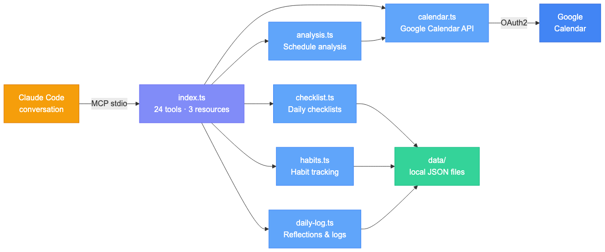
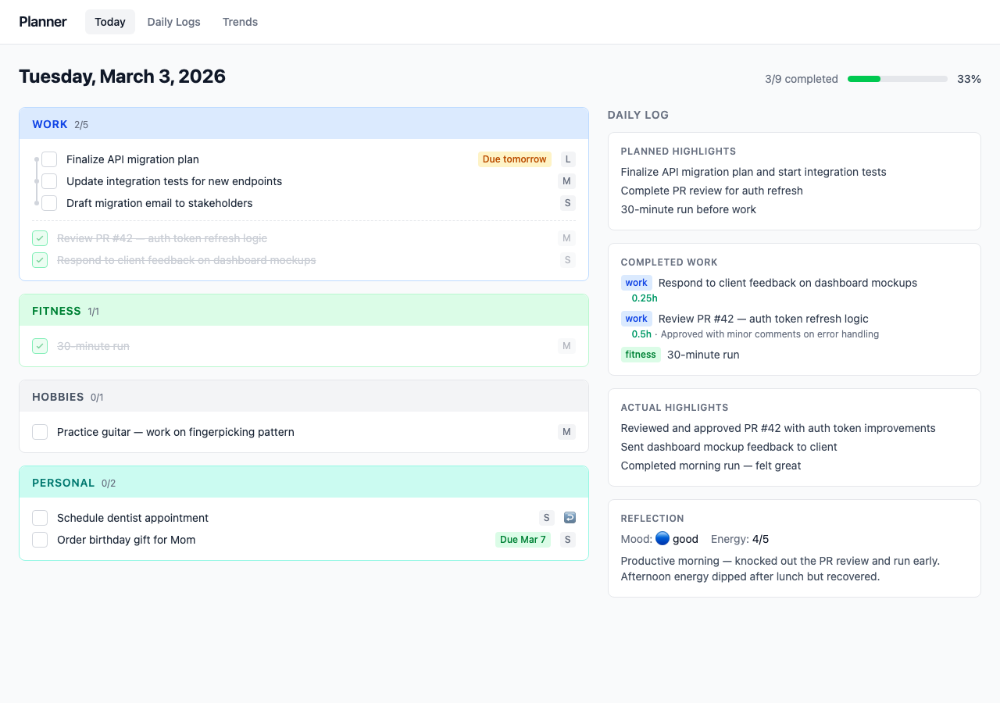

# Personal Planner MCP Server

A personal productivity system you clone and run as your own. It's an [MCP](https://modelcontextprotocol.io/) server that turns Claude Code into an intelligent scheduling partner and daily accountability system — connecting to your Google Calendar to analyze schedule density, detect conflicts, respect your energy patterns, track life-area balance, manage daily checklists, build habits, and log reflections through natural conversation.

**How ownership works:** You clone this repo and configure it with your own Google OAuth credentials. All your data — tokens, preferences, checklists, daily logs — stays local in a gitignored `data/` directory. You interact with it entirely through Claude Code, where it registers as an MCP server.

## How It Works

The server gives Claude Code direct access to your calendar, checklist, habits, and daily logs. When you ask Claude about your schedule or productivity, it can:

- **Analyze your day** — density scoring (light/moderate/heavy/overloaded), overlap detection, and back-to-back warnings
- **Match tasks to energy** — flag when demanding events land in low-energy periods based on your personal patterns
- **Track life-area balance** — compare scheduled hours against weekly targets across configurable life areas
- **Find open slots** — locate free time filtered by minimum duration and energy level
- **Manage events** — create, update, and delete calendar events conversationally
- **Run daily checklists** — add, complete, and carry over tasks with area-based priority sorting
- **Track habits** — define habits with weekly targets and track completion over time
- **Log daily reflections** — capture mood, energy, highlights, and adjustments per day
- **Onboard interactively** — guided setup for OAuth, calendar config, profile, and preferences

Events are automatically categorized into life areas using configurable keyword matching (e.g., "Sprint planning" maps to work, "Gym session" maps to fitness). The keyword map can be customized via preferences. Analysis runs locally — only raw calendar data is fetched from Google.

### Example

> **You:** "Good morning"
>
> Claude runs the `/daily-checkin` skill: reviews yesterday's unfinished items, asks for a quick reflection, then shows today's calendar, checklist, and free slots with a suggested order of attack.

> **You:** "Find me 90 minutes for focused coding this week during high energy time"
>
> Claude calls `calendar_find_free_slots` filtered by high energy and shows available windows.

> **You:** "Mark the API migration done — took about 2 hours"
>
> Claude marks the checklist item complete, asks about billing notes, and updates today's daily log highlights.

## Getting Started — Two Usage Models

### Quick start (clone directly)

Clone this repo, configure Google OAuth, and start using it. Your `data/` directory is gitignored, so you can pull upstream updates without overwriting your personal config.

```bash
git clone https://github.com/j-roche-dev/personal-planner.git
cd personal-planner
```

### Own project (fork/copy)

Create your own repo (e.g. "my-planner") for full control over customizations. More isolated, but you manage upstream sync yourself.

Either way, continue with the [Setup](#setup) steps below.

## Recommended Workflow

Value comes from daily use. Here's the cadence the planner is designed around:

- **Weekday mornings:** Say "Good morning" → triggers `/daily-checkin` (review yesterday, plan today)
- **Weekend mornings:** Say "Good morning" → triggers `/weekend-checkin` (lighter touch, recharge focus)
- **Sunday evening / Monday morning:** `/weekly-planning` — set priorities and schedule habits for the week
- **End of week:** `/weekly-review` — retrospective with habit trends and mood/energy patterns
- **Anytime, from any project:** `/log-work` — log completed work back to the planner's checklist and daily log

## Architecture



```
src/
├── index.ts                 # MCP server — registers 24 tools, 3 resources, 2 prompts
├── env.ts                   # Loads .env from project root
├── types.ts                 # TypeScript interfaces
└── services/
    ├── calendar.ts          # Google Calendar API wrapper + OAuth flow
    ├── storage.ts           # JSON file I/O for all data
    ├── analysis.ts          # Pure functions: density, conflicts, energy, free slots
    ├── checklist.ts         # Daily checklist CRUD with carry-over
    ├── habits.ts            # Habit definition CRUD + completion rates
    └── daily-log.ts         # Per-day logs: habits, reflections, highlights
dashboard/
├── src/                     # React dashboard app (Vite + Tailwind v4 + Recharts)
├── vite-plugin-data-api.ts  # Serves read-only JSON API from data/
└── ...
.claude/skills/
├── daily-checkin/           # Weekday morning check-in
├── weekend-checkin/         # Light weekend check-in
├── weekly-planning/         # Guided weekly planning session
└── weekly-review/           # End-of-week retrospective
data/
├── preferences.json         # Scheduling preferences (gitignored)
├── tokens.json              # OAuth tokens (gitignored)
├── profile.json             # User profile
├── habits.json              # Habit definitions
├── setup-status.json        # Onboarding progress
├── checklists/              # Per-day checklist JSON files
└── daily-logs/              # Per-day log JSON files
```

> **Data stays local.** Everything in `data/` is gitignored — upstream pulls won't touch your personal config, tokens, or logs. The tracked file `data/preferences.example.json` serves as a template for new users.

## Setup

### Prerequisites

- Node.js v22+
- [Claude Code](https://docs.anthropic.com/en/docs/claude-code) CLI installed

### 1. Install dependencies

```bash
npm install
cd dashboard && npm install && cd ..
```

### 2. Configure Google OAuth

You'll need a Google Cloud project with Calendar API credentials:

1. Go to [Google Cloud Console](https://console.cloud.google.com/) and create a project (or use an existing one)
2. Enable the [Google Calendar API](https://console.cloud.google.com/apis/library/calendar-json.googleapis.com)
3. Go to **APIs & Services > OAuth consent screen** and configure it:
   - Choose **External** user type
   - Fill in the required fields (app name, support email, developer email)
   - On the Scopes step, you can skip adding scopes (the app requests them at runtime)
   - Add your Google email as a **Test user**
4. Go to **APIs & Services > Credentials** and create an **OAuth client ID**:
   - Application type: **Desktop app**
   - Copy the **Client ID** and **Client Secret**
5. Create your `.env` file:

```bash
cp .env.example .env
```

Paste your `GOOGLE_CLIENT_ID` and `GOOGLE_CLIENT_SECRET` into `.env`.

### 3. Authenticate with Google Calendar

```bash
npm run auth
```

This opens a browser for the OAuth consent flow. Tokens are saved to `data/tokens.json` and refresh automatically.

> **Token expiry heads-up:** While your OAuth consent screen is in Google's "Testing" mode, tokens expire after ~7 days. You'll see a clear error message when this happens — just re-run `npm run auth`. To avoid the recurring expiry, publish your consent screen in the Google Cloud Console (it's still private to your test users, but tokens last indefinitely).

### 4. Build

```bash
npm run build
```

### 5. Register as Claude Code MCP server

```bash
claude mcp add --transport stdio --scope user personal-planner -- node /path/to/personal-planner/build/index.js
```

Replace `/path/to/personal-planner` with the actual path to this repo.

### 6. Verify and onboard

In Claude Code, ask it to ping the personal planner. You should see `googleCalendar: "authenticated"` in the response.

On first use, the server will suggest running the **setup-technical** and **setup-personal** prompts to configure your planner calendar, profile, life areas, energy patterns, habits, and goals through a guided conversation.

**First session:** After onboarding, try saying "Good morning" — Claude will detect the time of day and trigger the appropriate check-in skill (daily or weekend). This is the main entry point for daily use.

## Tools

### Calendar

| Tool | Description |
|---|---|
| `ping` | Health check — reports server, auth, and setup status |
| `calendar_get_events` | Fetch events for a date range |
| `calendar_create_event` | Create a calendar event |
| `calendar_update_event` | Update an existing event |
| `calendar_delete_event` | Delete an event |
| `calendar_find_free_slots` | Find available time slots by duration and energy level |
| `calendar_list` | List available Google Calendars |
| `schedule_analyze` | Analyze a day for conflicts, density, balance, and free slots |

### Checklist

| Tool | Description |
|---|---|
| `checklist_get` | Get today's checklist (or a specific date), with carry-over of incomplete items |
| `checklist_add` | Add an item with area, size, and optional deadline |
| `checklist_update` | Mark complete, update text/area/size, add billing notes |
| `checklist_remove` | Remove an item |
| `checklist_chain` | Chain items in sequential order within an area |

### Habits & Daily Logs

| Tool | Description |
|---|---|
| `habit_list` | List habits with optional completion rates |
| `habit_add` | Add a new habit to track |
| `habit_update` | Update a habit definition |
| `habit_remove` | Remove a habit |
| `daily_log_get` | Get a day's log (habits, reflection, highlights) |
| `daily_log_update` | Update a day's log (mark habits, add reflection) |
| `daily_log_recent` | Get recent logs for trend analysis |

### Preferences & Profile

| Tool | Description |
|---|---|
| `preferences_get` | Read current user preferences |
| `preferences_update` | Update preferences (deep-merged) |
| `profile_get` | Read user profile |
| `profile_update` | Update user profile |

## Resources

| URI | Description |
|---|---|
| `planner://preferences` | Current user preferences as JSON |
| `planner://schedule/today` | Today's schedule with full analysis |
| `planner://schedule/week` | This week's schedule with per-day and weekly summary |

## Skills

Recurring workflows are implemented as [Claude Code skills](https://docs.anthropic.com/en/docs/claude-code/skills) that orchestrate the MCP tools interactively. Skills live in `.claude/skills/` and travel with the clone — no separate installation needed.

| Skill | Invocation | When |
|---|---|---|
| Daily Check-In | `/daily-checkin` | Weekday mornings — review yesterday, plan today |
| Weekend Check-In | `/weekend-checkin` | Weekend mornings — light touch, recharge focus |
| Weekly Planning | `/weekly-planning` | Sunday evening / Monday morning — plan the week |
| Weekly Review | `/weekly-review` | End of week — retrospective with trends |

## Cross-Project Work Logging

The `/log-work` global skill lets you log work from any project back to the planner's checklist and daily log. It auto-summarizes the session, fuzzy-matches checklist items, handles billing, and updates highlights.

**Installation:** Copy `templates/log-work-skill/SKILL.md` to `~/.claude/skills/log-work/SKILL.md`. Then register the MCP server globally so other projects can reach the planner:

```bash
claude mcp add --scope user personal-planner -- node /path/to/personal-planner/build/index.js
```

**`.planner` file convention:** Place a `.planner` JSON file in project roots to pre-configure the work area:

```json
{ "area": "work", "description": "Main client project" }
```

The skill reads `area` from this file so you don't have to specify it each time.

## Dashboard

A read-only React dashboard for visual overview of your checklist, daily logs, and trends.



```bash
npm run dashboard    # or: cd dashboard && npm run dev
```

Opens at `http://localhost:5173` with three views:

- **Today** — checklist grouped by area + daily log side-by-side
- **Daily Logs** — date navigation with reflection, habits, highlights
- **Trends** — habit completion grid, mood/energy charts, checklist throughput

The dashboard reads directly from `data/` via a Vite dev server plugin — no separate backend needed.

## Preferences

Use the `preferences_update` tool or the setup-personal onboarding flow to configure:

- **Energy patterns** — high/medium/low energy time ranges that map to your daily rhythm
- **Life areas** — weekly hour targets and priorities (fully customizable area names)
- **Scheduling rules** — min break between events, max meetings/day, protected blocks, planner calendar ID
- **Category keywords** — custom keyword-to-area mapping for event categorization

## Development

```bash
npm run dev          # Run with tsx (hot reload)
npm run build        # Compile TypeScript
npm test             # Run tests (vitest)
npm run test:watch   # Watch mode
npm run auth         # Re-run OAuth flow
npm run dashboard    # Launch dashboard dev server
```

## Testing

Tests use [Vitest](https://vitest.dev/) and cover analysis, checklist, habits, and daily log services (99 tests).

```bash
npm test              # Single run
npm run test:watch    # Watch mode
```

## License

MIT
